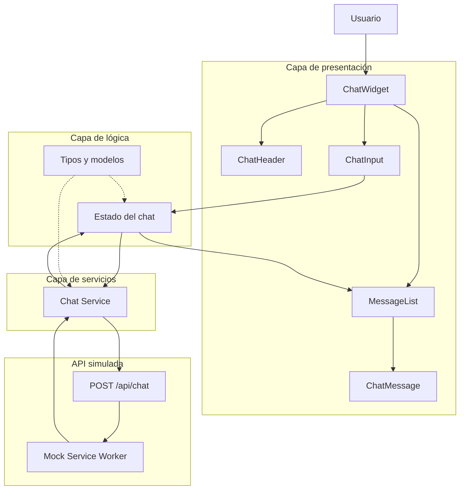

# Arquitectura de AGIChat SDK

## 1. Descripción general

AGIChat SDK es un widget de chat reutilizable diseñado para proporcionar una interfaz gráfica a sistemas agénticos. El objetivo principal de la arquitectura es mantener separada la interfaz de usuario de la implementación del agente o servicio que genera las respuestas.

Durante la primera fase del proyecto, el widget se comunicará con un endpoint simulado. Esta separación permitirá que, en fases posteriores, el servicio simulado pueda ser reemplazado por un agente real sin necesidad de modificar los componentes principales de la interfaz.

## 2. Arquitectura seleccionada

El proyecto utiliza una **arquitectura por capas basada en componentes**, adecuada para una aplicación construida con React.

La aplicación se divide principalmente en las siguientes responsabilidades:

- **Presentación:** contiene los componentes visuales del widget de chat.
- **Lógica:** administra el estado, los mensajes y el comportamiento del chat.
- **Servicios:** abstrae la comunicación entre la interfaz y el servicio que procesa los mensajes.
- **Mock API:** simula el endpoint que posteriormente será reemplazado o conectado con el agente real.

Esta separación busca reducir el acoplamiento entre los componentes y facilitar las pruebas, el mantenimiento y la evolución del SDK.

## 3. Diagrama de arquitectura

El siguiente diagrama muestra el flujo de información entre las principales capas del sistema:



## 4. Estructura del proyecto

La estructura del proyecto está organizada por responsabilidad. Los componentes visuales, la lógica, los servicios y los mocks se mantienen separados para evitar dependencias innecesarias y facilitar el crecimiento del SDK.

```text
agichat-sdk/
├── .github/
│   └── workflows/
│       └── ci.yml
├── docs/
│   └── ARQUITECTURA.md
├── public/
├── src/
│   ├── components/
│   │   ├── ChatWidget/
│   │   ├── ChatHeader/
│   │   ├── MessageList/
│   │   ├── ChatMessage/
│   │   └── ChatInput/
│   ├── hooks/
│   ├── services/
│   │   └── chatService.ts
│   ├── mocks/
│   │   ├── handlers.ts
│   │   └── browser.ts
│   ├── types/
│   │   └── chat.ts
│   ├── test/
│   │   └── setup.ts
│   ├── App.tsx
│   └── main.tsx
├── AGENTS.md
├── package.json
└── vite.config.ts
```

### Componentes

`src/components/` contiene exclusivamente elementos relacionados con la interfaz gráfica. Cada componente de tamaño significativo debe mantenerse en su propia carpeta para permitir que sus pruebas y estilos puedan crecer junto con él.

### Hooks

`src/hooks/` contiene lógica reutilizable de React. La lógica que administre el comportamiento del chat puede extraerse a hooks cuando hacerlo reduzca la responsabilidad de los componentes visuales.

### Servicios

`src/services/` contiene las abstracciones utilizadas para comunicarse con servicios externos. Los componentes no deben realizar directamente peticiones a la API. Esto permite reemplazar la implementación del servicio sin modificar la interfaz gráfica.

### Mocks

`src/mocks/` contiene la implementación de la API simulada utilizada durante la primera fase del proyecto. Esta capa existe únicamente para simular el servicio que posteriormente proporcionará el sistema agéntico.

### Tipos

`src/types/` contiene los tipos e interfaces compartidos del dominio del chat, por ejemplo mensajes, roles y contratos utilizados entre componentes y servicios.

### Pruebas

Los archivos de prueba relacionados directamente con un componente o módulo pueden mantenerse cerca del código que prueban. `src/test/` se utiliza para configuración global y utilidades compartidas por las pruebas.

## 5. Justificación de decisiones

### Arquitectura por capas

Se seleccionó una arquitectura por capas basada en componentes porque permite separar las responsabilidades principales del sistema sin introducir complejidad innecesaria. Para un SDK de interfaz de chat, esta estructura permite que los componentes visuales evolucionen independientemente de la forma en que se obtienen las respuestas.

### Abstracción del servicio de chat

La comunicación con el backend se mantiene fuera de los componentes visuales mediante una capa de servicios. De esta forma, la interfaz no depende directamente de la implementación utilizada para generar respuestas.

Durante la primera fase, esta capa se comunica con una API simulada. En fases posteriores podrá conectarse con el sistema agéntico real manteniendo el mismo contrato de comunicación.

### API simulada con MSW

Mock Service Worker (MSW) se utiliza para simular el endpoint del chat. Esto permite desarrollar y probar la interfaz utilizando peticiones HTTP sin requerir un backend real durante esta fase.

La aplicación puede comportarse como si estuviera conectada a un servicio externo, facilitando posteriormente la sustitución del mock por el endpoint real.

### React y TypeScript

React permite construir el widget mediante componentes pequeños y reutilizables. TypeScript agrega tipado estático a los mensajes, propiedades de los componentes y contratos de servicios, ayudando a detectar errores durante el desarrollo y facilitando el mantenimiento del SDK.

### Pruebas automatizadas

Vitest y React Testing Library se utilizan para verificar el comportamiento de los componentes y de la lógica del sistema. El proyecto establece un mínimo de 80% de cobertura para líneas, funciones, ramas y sentencias.

### Crecimiento del proyecto

La estructura propuesta busca permitir que el proyecto crezca sin concentrar toda la funcionalidad en los componentes principales. Al agregar nuevas funcionalidades se deben mantener las responsabilidades separadas:

- Los nuevos elementos visuales deben agregarse en `components/`.
- La lógica reutilizable de React puede agregarse en `hooks/`.
- Las integraciones externas deben implementarse en `services/`.
- Los tipos compartidos deben mantenerse en `types/`.
- Los mocks utilizados durante desarrollo y pruebas deben mantenerse en `mocks/`.

La estructura mostrada anteriormente representa la estructura objetivo del proyecto. Algunas carpetas o archivos pueden crearse progresivamente conforme sean necesarios durante la implementación.